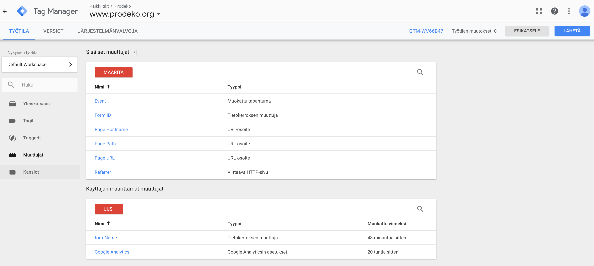

# Analytiikasta :mailbox_with_mail::email:

- **Päivitetty** 18.1.2019
- **Tekijä:** Timo Riski

Sivustolle on konfiguroitu [Google Analytics](https://analytics.google.com) ja [Google Tag Managerin](https://tagmanager.google.com) jotta voidaan seurata kuinka sivustoa käytetään. 

## Setup

1. Luo uusi Google Analytics tili


2. Luo uusi Google Tag Manager tili


3. Lisää `<body>` ja `<head>` elementteihin GTM

`<head>` elementin alkuun:
```
  <!-- Google Tag Manager -->
  <script>(function(w,d,s,l,i){w[l]=w[l]||[];w[l].push({'gtm.start':
  new Date().getTime(),event:'gtm.js'});var f=d.getElementsByTagName(s)[0],
  j=d.createElement(s),dl=l!='dataLayer'?'&l='+l:'';j.async=true;j.src=
  'https://www.googletagmanager.com/gtm.js?id='+i+dl;f.parentNode.insertBefore(j,f);
  })(window,document,'script','dataLayer','GTM-WV66B47');
  </script>
  <!-- End Google Tag Manager -->
```

`<body>` elementin alkuun:
```
  <!-- Google Tag Manager (noscript) -->
  <noscript><iframe src="https://www.googletagmanager.com/ns.html?id=GTM-WV66B47" height="0" width="0" style="display:none;visibility:hidden"></iframe></noscript>
  <!-- End Google Tag Manager (noscript) -->
```

4. Määritä tarvittavat tägit, triggerit ja muuttujat Google Tag Manageriin. 
- Lisätietoja GTM toiminnasta on luettavissa [täältä](https://support.google.com/tagmanager/answer/6102821?hl=fi).


*Tägit*

*Triggerit*

*Muuttujat*

5. Tämän jälkeen Google Analytics toimii!


## Mitä kaikkea voi seurata?

GTM:n kautta voi asentaa monenlaisia tagejä: sivuston katselukerrat, kuvan/linkin klikkaus, lomakkeen lähetys etc.

## Muuta

Google Analyticsiin on configuroitu linkitys Prodekon Google Ads accountin kanssa.

