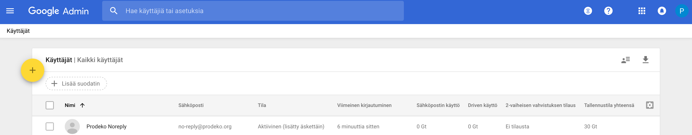
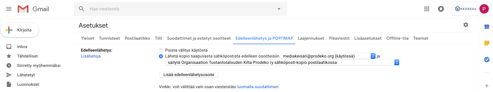

# app_apply_for_membership :email::school_satchel:

Prodekon uusien jäsenten hyväksymisen automatisointi. Päivitetty 25.12.2018.

## Setup

1. Luotiin uusi käyttäjä no-reply@prodeko.org G Suiteen

2. Kirjaudu sisään uudelle käyttäjälle ja mene tilin asetuksiin

3. Salli vähemmän turvallisten sovellusten käyttöoikeus

3. Uudelleenohjaa no-reply@prodeko.org osoitteeseen lähetetyt mailit mediakeisarille
- https://support.google.com/mail/answer/10957?hl=en

## Kehittäjät

* Kalle Hiltunen
* Timo Riski