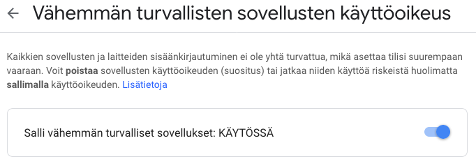

# app_membership :email::school_satchel:

- **Päivitetty** 15.1.2019
- **Tekijä:** Timo Riski, Kalle Hiltunen

Prodekon uusien jäsenten hyväksymisen automatisointi.

## Setup

1. Luotiin uusi käyttäjä no-reply@prodeko.org G Suiteen
   
2. Kirjaudu sisään uudelle käyttäjälle ja mene tilin asetuksiin
   
3. Salli vähemmän turvallisten sovellusten käyttöoikeus
   
   

# Sähköposteista :mailbox_with_mail::email:

Katso yleinen dokumentaatio sähköposteista emailit.md tiedostosta.

# Käyttö

Kun app_membershipin jäsenhakulomake lähetetään palvelimelle, lähtee mediakeisarille yhteenvetoviesti jäsenhakemuksesta. Tämän jälkeen jäsenhakemus käsitellään hallituksen kokouksessa, jonka tuloksena hakemus joko hyväksytään tai hylätään. Hyväksyminen ja hylkääminen tapahtuvat Djangon admin paneelissa ja kummastakin toimenpiteestä lähtee maili hakijalle. Mailipohjat löytyvät prodekoorg/app_membership/templates/emails/ hakemistosta. Jokaisesta pohjasta on teksti ja html-versio.
