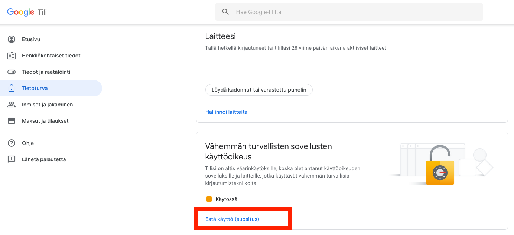
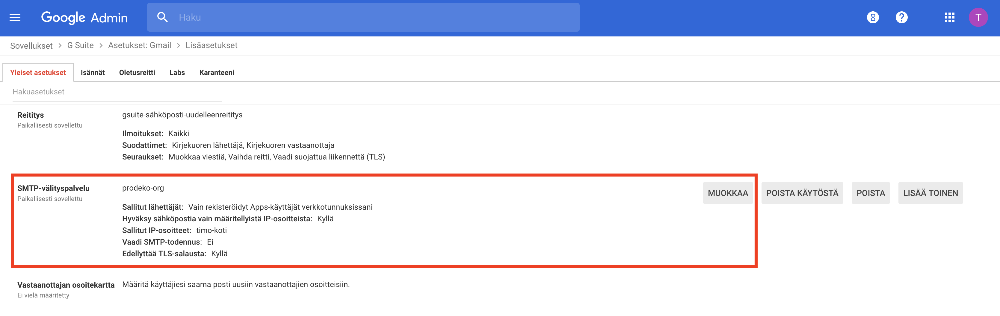
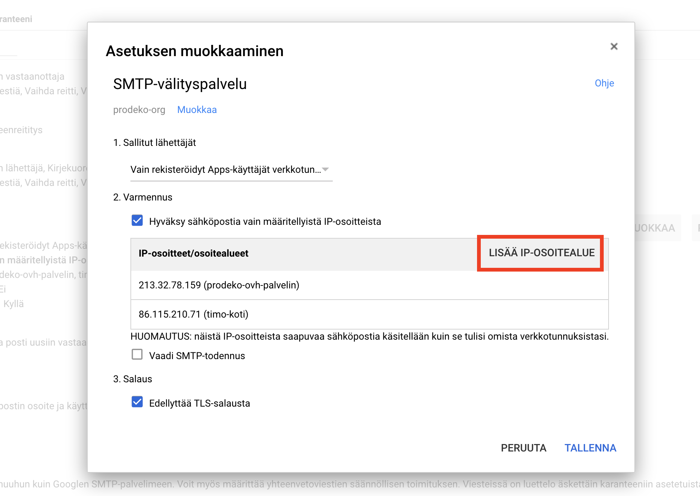
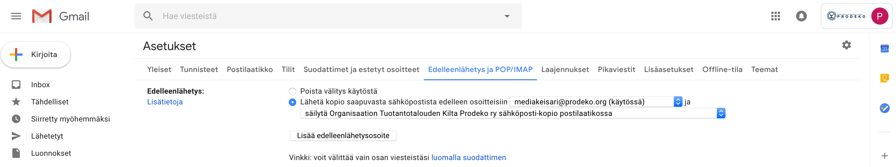

# Sähköposteista :mailbox_with_mail::email:

- **Päivitetty** 15.1.2019
- **Tekijä:** Timo Riski

Projektin automaattisesti lähetettävät sähköpostit kulkevat smtp-relay.gmail.com palvelimen kautta. Tässä dokumentissa kerrotaan lisätietoja mailikonfiguraatiosta yleisesti.

## Setup

1. Salli vähemmän turvalliset sovellukset osoitteessa https://myaccount.google.com/security
   
2. Muokkaa G Suiten Gmail admin paneelista (Sovellukset > G Suite > Aetukset: Gmail > Lisäasetukset) SMTP-välityspalvelun sallitut IP-osoitteet.

- HUOM! Aallon verkossa olevat IP-osoitteet eivät toimi!
  
  

3. Uudelleenohjaa no-reply@prodeko.org osoitteeseen lähetetyt mailit mediakeisarille (siltä varalta että joku vastaa tähän osoitteeseen)

- https://support.google.com/mail/answer/10957?hl=en
  

4. Muokkaa settings.py:

```
# Email config. See documentation/app_apply_for_membership.md or emailit.md
# on more details about how email sending works through G Suite.
EMAIL_BACKEND = 'django.core.mail.backends.smtp.EmailBackend'
EMAIL_HOST = 'smtp-relay.gmail.com'
EMAIL_HOST_USER = config['EMAIL']['USER']
EMAIL_HOST_PASSWORD = config['EMAIL']['PASSWORD']
DEFAULT_FROM_EMAIL = 'no-reply@prodeko.org'
SERVER_EMAIL = 'no-reply@prodeko.org'
EMAIL_PORT = 587
EMAIL_USE_TLS = True
```

## Milloin sähköposteja lähtee?

**1. Automaattiset virheviestit**

Projekti lähettää sähköposteja kaikista ERROR tason virheistä sekä kaikista rikki olevista linkeista. Settings.py:ssä on määritetty ADMINS ja MANAGERS muuttujat, joihin sähköpostit pamahtavat.

Settings.py:

```
# When DEBUG = False, all errors with level ERROR or
# higher get mailed to ADMINS according to LOGGING conf
ADMINS = [('CTO', 'cto@prodeko.org'), ]
# When DEBUG = False, all broken links get emailed to MANAGERS
MANAGERS = [('CTO', 'cto@prodeko.org'), ]
```

**2. Appien lähettämät sähköpostit**

auth_prodeko

- Password reset maili

app_apply_for_membership

- Infomaili mediakeisarille
- Hylkäys/hyväksymismaili hakijalle

app_kulukorvaus

- Yhteenvetomaili kulukorvauksen lähettämisen jälkeen

## Muuta

no-reply@prodeko.org osoitteeseen lähetetyt sähköpostit uudelleenohjautuvat mediakeisari@prodeko.org osoitteeseen.
