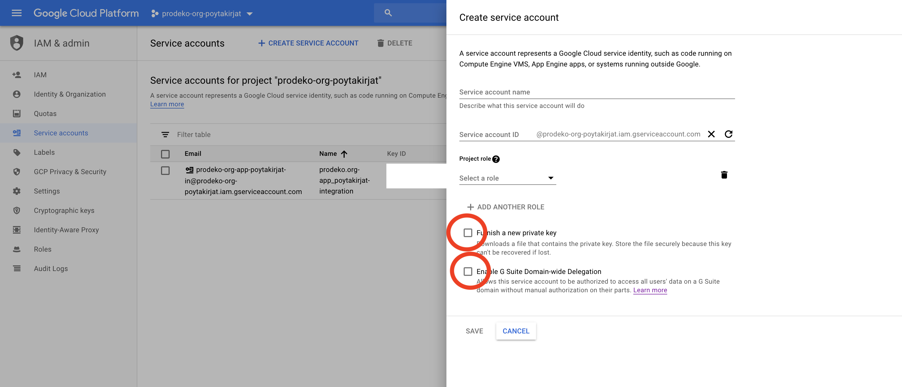
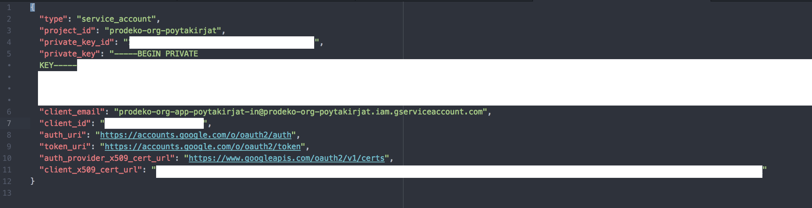
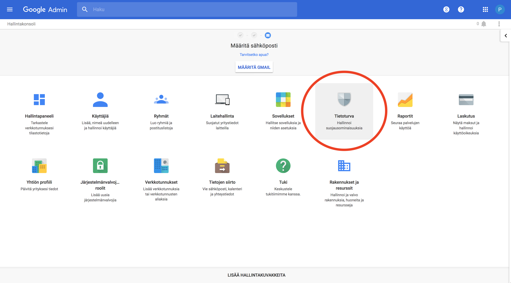
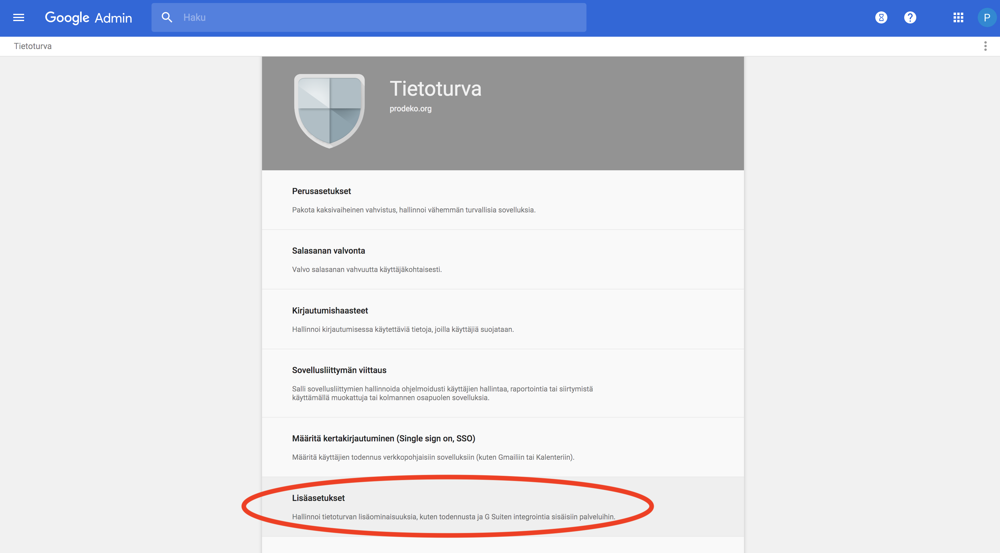
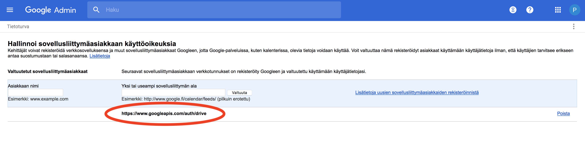

# app_poytakirjat :page_facing_up::page_with_curl::bookmark_tabs:

Prodeko.org + G Drive integraatio pöytäkirjojen lisäämiseksi automaattisesti prodeko.orgiin.

## Setup

1. Luo uusi projekti Google Cloud Platformiin https://console.developers.google.com/

2. Luo 'service account'
   https://developers.google.com/identity/protocols/OAuth2ServiceAccount#creatinganaccount
   - Lisäksi anna accountille projektin 'Owner' oikeus ja 'Domain wide authority' oikeus ja lataa private key

3. Anna service accountille 'Domain wide authority' G Suiten admin consolesta (vain mediakeisarilla pääsy). https://developers.google.com/identity/protocols/OAuth2ServiceAccount#delegatingauthority

## Käyttö

Pöytäkirjojen lataaminen tapahtuu admin-consolesta osoitteesta /fi/admin/app_poytakirjat/dokumentti.

- HUOM! JOS LATAAT USEITA PÖYTÄKIRJOJA LATAUKSESSA SAATTAA KESTÄÄ JOPA MINUUTTI!
- Kirjoita ensin Kokouskansion folderId. 1. Mene Driven kokoukset kansioon 2. Kopioi urlin FOLDERID (drive/u/1/folders/<FOLDERID>).
- Klikkaamalla 'Lataa pöytäkirjat Drivestä' 'Kokoukset'-kansiossa olevat pöytäkirjat latautuvat Driven API:n avulla.
- Vain pöytäkirjat joita ei ole admin paneelin listassa ladataan. Pöytäkirjojen manuaalinen lisäys onnistuu painamalla 'Lisää pöytäkirja'
- Pöytäkirjan tulee olla Driven kansiossa, joka on nimetty seuraavasti: <järjestysnumero>\_<pp.kk.yyyy> (esim. 12_19.3.2018 tai 35_12.10.2018 - huom! Kuukaudessa ei saa olla edessä 0).  
- Pöytäkirjan tulee olla Google Docs muodossa (ei .docx tai .pdf) ja nimetty alkaen 'Pöytäkirja' (esim. Pöytäkirja_04) Liitteet tulee nimetä alkaen 'LIITE' (esim. LIITE-1_laskuliite, LIITE-2_esitys-x). Liitteitä voi olla useita.
- LIITE-sanan jälkeen tuleva järjestysnumero määrää missä järjestyksessä liitteet lisätään lopulliseen pdf-tiedostoon.
- Pöytäkirja ja liitteet ladataan ja yhdistetään yhdeksi pdf-tiedostoksi ja ne tulevat automaattisesti sivustolle /dokumentit näkyviin.

## Rakennuspalikat

* [Google Drive API v3](https://developers.google.com/drive/api/v3/reference/) - Yhdistäminen G Suiten Driveen pöytäkirjojen lataamiseksi.
* [PyPDF2](https://pythonhosted.org/PyPDF2/) - PDF-tiedostojen yhdistäminen yhdeksi tiedostoksi.

## Kehittäjät

* Timo Riski
